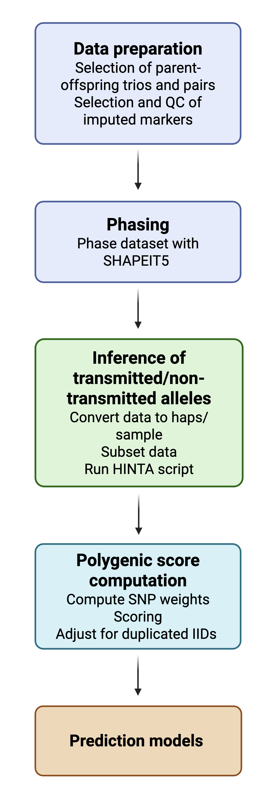

# Haplotype-based Inference of Non-transmitted Alleles (HINTA)

This repository provides a walkthrough and code for the HINTA pipeline used to generate polygenic scores for transmitted and non-transmitted haplotypes. 

This pipeline combines `Bash`, `Python`, and `R` scripts and is designed for genotyping datasets including individuals with at least one genotyped parent (parent-offspring trios and pairs). 

---

## Table of Contents
- [Overview](#overview)
- [Requirements](#requirements)
- [Flowchart](#flowchart)
- [Pipeline Structure](#pipeline-structure)
- [Technical Considerations](#technical-considerations)
- [Citation](#citation)

---

## Overview

The HINTA pipeline was designed to separate transmitted and non-transmitted haplotypes in parent-offspring trios (father-mother-child) and pairs (father-child or mother-child), with the aim to compute polygenic scores and downstream modeling of genetic nurture and direct genetic transmission effects. Instead of SNP-by-SNP comparisons, HINTA uses haplotype-based matching between parents and offspring data. 

The pipeline works as follows:

 **Phased data**: Input genotype data must be phased. We recommend to use SHAPEIT5 to phase genotypes.

 **Tiling**: Chromosomes are divided into tiles of 150 adjacent SNPs to compare haplotypes across genomic regions and detect mismatches or potential recombination sites. Each tile overlaps with the previous and next tiles by 50 SNPs to capture possible recombination events near the boundaries of each tile. (See Figure 1 in [Citation](#citation))

 **Matching**: 
- For each parent, the offspring’s haplotypes are compared to both parental haplotypes tile-by-tile.
- The haplotype with the highest match is assumed to be transmitted.
- If the match between the offspring's tile and the best matching parental tile is <99.8%, the other haplotype from the same parent is checked to account for possible recombination or mismatches.

 **Haplotype Assignment:**
  - Transmitted haplotypes are determined by combining the best-matching parental tiles across tiles, with switches to the alternative haplotype from the same parent in cases of recombination.
  - Non-transmitted haplotypes are defined as the remaining tiles from each genotyped parent.
  - For non-genotyped parents, non-transmitted haplotypes are set as missing. Transmitted haplotypes from the non-genotyped parent are inferred from the offspring’s haplotypes not shared with the genotyped parent.

For further explanation, see description paper in [Citation](#citation).

**Note:** 
1. HINTA does *not* rely on external reference panels, population allele frequencies, or identity-by-descent (IBD) estimation.

2. This pipeline was developed for a specific project using the Lifelines dataset and reflects the data structure and computational setup used at the time. The code is not generalized for broad application, therefore scripts require adaptation to fit other datasets and environments. If you have questions about adapting the pipeline, feel free to reach out.

---

## Requirements

- **Bash** (>= 4.0)
- **Python** (>= 3.8): `pandas`, `numpy`
- **R** (>= 4.0): `data.table`, `dplyr`
- **[PLINK2](https://www.cog-genomics.org/plink/2.0/)**
- **[SHAPEIT5](https://odelaneau.github.io/shapeit5/)**
- **[BCFtools](https://samtools.github.io/bcftools/bcftools.html)**

---

## Flowchart

---

## Pipeline Structure

> This tutorial demonstrates how the pipeline works on a single chromosome. For full-genome data, we recommend running the pipeline in parallel for the 22 chromosomes. Example scripts to use the SLURM job scheduler in a high-performance computing cluster (HPC) to do this are provided.

### 0. Data preparation:
As a starting point, this pipeline requires imputed genotype data and a .fam file that specifies the genotyped parent-offspring pairs and trios (for phasing).

In our dataset, we applied QC to imputed genotypes (e.g., INFO > 0.8, MAF filters, filter to HapMap3) and extracted the overlapping set of high-quality SNPs shared across three genotyping arrays. SNP harmonization steps (e.g., resolving strand flips, ambiguous SNPs, and liftover) were performed before merging.

For computational efficiency, we recommend restricting the dataset to include only genotyped offspring and parents, and relevant markers. 

**Note**: as HINTA compares tiles of adjacent SNPs between parents and offspring, it is essential that the same SNPs are available for both across the genome.

### 1. Phasing:

Phasing is performed with [SHAPEIT5](https://odelaneau.github.io/shapeit5/) `phase_common_static`, using genotype data from parents and offspring. This requires a .fam file that defines parental relationships and enables phasing within families.

An example script is provided [01_submit_phasing_jobs.sh](/scripts/01_submit_phasing_jobs.sh), which generates and submits one SLURM job per chromosome. Each job takes a .vcf.gz file as input and outputs phased genotypes in BCF format.

### 2. Inference of transmitted/non-transmitted alleles:

This is the main step, which assigns transmitted and non-transmitted haplotypes by comparing offspring haplotypes to those of their genotyped parents, tile-by-tile along each chromosome. The transmitted haplotype is inferred based on the best match within each tile, allowing for occasional mismatches or recombination events. The non-transmitted haplotypes are the remaining parental haplotypes, or set to missing for the parent with missing genotype information.

**Input**

- `.haps` and `.sample` format (Oxford phased haplotype file) including data from all offspring and parents. We recommend to use [PLINK2](https://www.cog-genomics.org/plink/2.0/) to convert from VCF to haps/sample.

`.sample file`: 
Contains metadata for each individual, including IDs, family structure, sex, and phenotype values.

File structure:

1. **First header**: Column names (e.g., `ID_1`, `ID_2`, `missing`, `father`, `mother`, `sex`, `phenotype`)
2. **Second header**: Field types or defaults (e.g., `0`, `D`, `B`)
3. **Data rows**: One line per individual, with space-delimited values matching the headers

Example:
> ID_1 ID_2 missing father mother sex phenotype

> 0 0 0 D D D B

> 001 LL01 0 LL02 0 2 -9

`.haps file`: 
Contains phased haplotype data for each SNP and individual.

File structure: A space-separated text file with **no header line** with one SNP per row. 
> CHR  SNP_ID  POS  A1  A2  HAP1_1  HAP1_2  HAP2_1  HAP2_2  ...

- `CHR`: Chromosome  
- `SNP_ID`: SNP identifier  
- `POS`: Base-pair position  
- `A1`, `A2`: Alleles at the SNP  
- `HAPx_1`, `HAPx_2`: Phased alleles (two columns per individual)

Total columns = 5 + (2 × number of individuals)

**Output**

- Two separate `.haps`/`.sample` files with transmitted and non-transmitted haplotypes.
- Non-transmitted haplotypes for missing parents are set to the letter `N`.
- Log files detailing processing steps and matching percentages.

**Subsetting the data**

To manage large datasets efficiently, we split the data into smaller subsets for processing. In our implementation, each subset included approximately 1,000 offspring (along with their genotyped parents), which was a practical compromise between runtime and memory usage given the available HPC resources.

We provide the scripts used in our own runs that can be adapted as needed:

- [02_prep_hinta_input.sh](/scripts/02_prep_hinta_input.sh): creates parent-offspring data subsets from .haps and .sample files using [subset_haps_sample.py](/scripts/subset_haps_sample.py)
- [03_run_hinta.sh](/scripts/03_run_hinta.sh): runs the main script [hinta_assign_tiles.py](/scripts/hinta_assign_tiles.py) in each subset 
- [04_merge_outputs.sh](/scripts/04_merge_outputs.sh): merges output files across subsets
   

### 3. Polygenic scores computation:

To compute polygenic scores (PGS) from the HINTA output, the data must first be adjusted to work with standard PGS scoring tools like PLINK.

HINTA produces one transmitted and one non-transmitted haplotype per parent-offspring trio/pair. When both parents are genotyped, this results in two haplotypes per file. If one parent is not genotyped, the corresponding non-transmitted haplotype is missing.

Because many PGS scoring tools require two columns of non-missing genotype data per individual, all individuals must be duplicated, essentially "splitting" each ID into two. If one haplotype is missing, the available one (i.e. the transmitted parental haplotype of the non-genotyped parent) is copied into both columns so that the data format remains consistent. ([05_split_and_convert_to_vcf.sh](/scripts/05_split_and_convert_to_vcf.sh))

After generating a genome-wide file ([06_create_genomewide_bed.sh](/scripts06_create_genomewide_bed.sh/)) and PGS scoring ([07_plink_scoring](/scripts/07_plink_scoring.sh)), the final step is a simple script to correct these duplicate entries ([08_adjust_pgs_output.sh](/scripts/08_adjust_pgs_output.sh)) by combining the PGSs to create a single transmitted and non-transmitted PGS per individual. For individuals with only one genotyped parent, the missing half of the non-transmitted score is set to missing.

**Note**: In the final output, H1 is always referring the paternal haplotype and H2 is always referring to the maternal haplotype, for both transmitted and non-transmitted PGS. This distinction can be used for running analyses by parent-of-origin.

---

## Technical Considerations

### SNP Density
The default tile size in HINTA (150 SNPs per tile, with a 50-SNP overlap) worked well on our dataset of approximately 1.5 million genome-wide markers. It allowed accurate detection of the best matching parental haplotypes while also tracing recombination events. However, SNP density can vary substantially across genomic regions.

*Example: the plot above shows uneven SNP density. The peak on chromosome 6 reflects the higher density of measured SNPs in the HLA/MHC region, a feature of the Infinium GSA Multi-Ethnic Disease Array.*

We recommend inspecting SNP density in your dataset before running the HINTA pipeline. High-density regions can disproportionately affect haplotype matching due to the larger number of SNPs, and matching may not work well. Consider removing such regions to maintain accuracy in transmitted/non-transmitted haplotype inference.

Tile size may need adjustment depending on SNP density:

- **High SNP density**: A **larger tile size** may help identify the correct match between offspring and parental haplotypes. High density can reduce variation between parental tiles due to linkage disequilibrium.
- **Low SNP density**: A **smaller tile size** may help avoid missing recombination events.

We recommend using a single chromosome to test different tile sizes by checking parent-offspring tile matches in the output file (e.g., 150, 300, 600 SNPs per tile). If matches are consistently too high (100%) or too low (<90%), the tile size is not optimal.

### Missing non-transmitted haplotypes

Non-transmitted haplotypes are inferred using phased data from genotyped parents only. In parent-offspring pairs, we cannot determine the NT contribution of the ungenotyped parent.

This missingness may introduce bias, especially if it is not random (e.g., more missing fathers). In our data, missing parental information was associated with reduced variance in non-transmitted PGS for parent-offspring pairs, and reduced precision in non-transmitted effect estimates. This should be taken into account when interpreting results. To address this, methods that model missing data directly such as structural equation models using full information maximum likelihood can be considered.

### No IBD or sibling-based inference
The current implementation of HINTA does not make use of identity-by-descent (IBD) information and does not incorporate data from siblings. As a result, parental alleles are inferred solely from parent-offspring genotype combinations, without leveraging shared haplotypes between siblings.

Future versions may include integration with tools that enable IBD-based inference (e.g. [SNIPar](https://snipar.readthedocs.io/en/latest/tutorial.html)) and can impute missing parental data in families with multiple genotyped offspring.

### Speed
HINTA is not currently optimized for speed or internal parallelization. The scripts were iteratively adapted during development and may require adjustments depending on input data. For large-scale datasets, we recommend to process data in parallel across genomic regions and sample subsets.

---

## Citation
This pipeline was developed collaboratively by Annique Claringbould, Hanna van Loo, Priscilla Kamphuis, and Victória Trindade Pons.

This tutorial is based on the method described in:  
Trindade Pons, V., Claringbould, A., Kamphuis, P., Oldehinkel, A. J., & van Loo, H. M. (2024). Using parent-offspring pairs and trios to estimate indirect genetic effects in education. Genetic Epidemiology, 48(4), 190–199. https://doi.org/10.1002/gepi.22554

Please cite the original paper if using this method.

